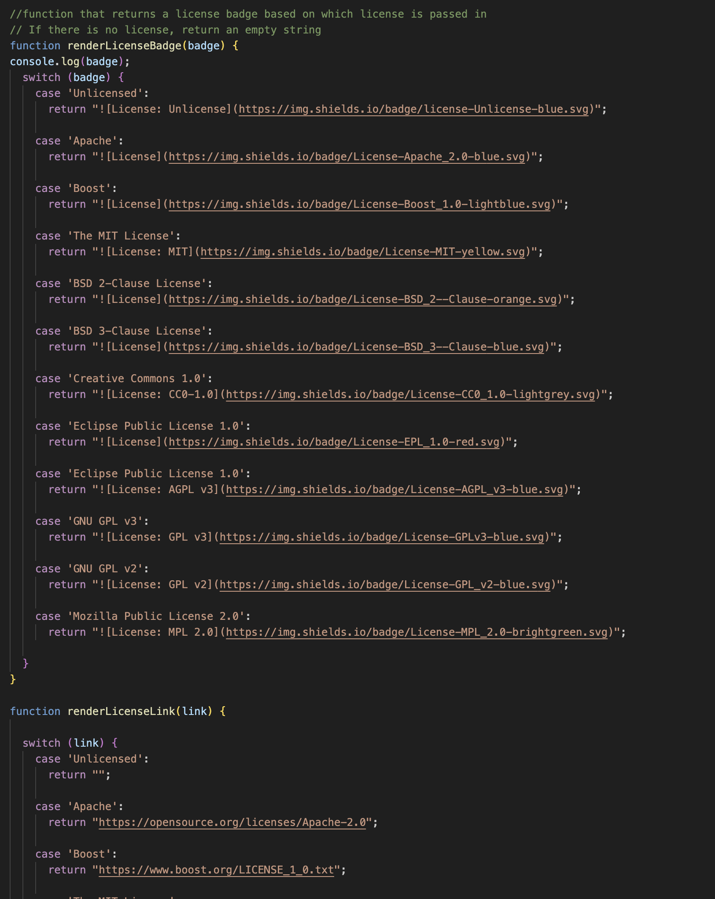

## Pam Willis README Generator  

# Description
    - This project was produced to create a more efficient method to make a .md file.
    - In order to make sure all information was entered, it is better to run thru a checklist.
    - It solves the problem of leaving something off and to make sure a license is attached with the full infomormation
    - In the process I learned about node js and how to implement node modules such as "inquirer". Also how to communicate with the user taking in all the information needed.  
    The following code shows how it was created:
importing info from generate markdown file, using inquirer to prompt user for information

then calling information to write file

matching up information according to what is selected

exporting information to index.js  

   

## &nbsp;&nbsp;&nbsp;  Installation
    Open the terminal and install inquirer version 8.2.4. enter "npm install --save inquirer@8.2.4"

## &nbsp;&nbsp;&nbsp;  Usage
    Once installed enter "npm start" in order to run the program. Enter information as needed to fill out the READMe.md document. Once all questions are completed a file will be created using the title entered as its file name.

## &nbsp;&nbsp;&nbsp;  Contributing
    This document was created with the assistance of AskBCS Learning Assistant and Carl Vega/Teaching Assistant

## &nbsp;&nbsp;&nbsp;  Tests
    

# Table of Contents
- [Installation](#installation)
- [Usage](#usage)
- [License](#license)
- [Contributing](#contributing)
- [Tests](#tests)
- [Questions](#questions)

# License
The MIT License  https://opensource.org/licenses/MIT

# Questions
please contact me with any questions:  
GitHub: https://github.com/PamWillis  
Email: pwillisop@yahoo.com
